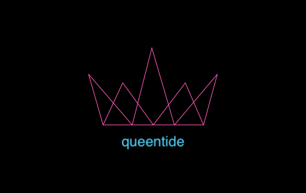

# Queentide

A multideck strategy game.

Created by [Issa Cortese](./MAINTAINERS.md) and licensed under a [Creative Commons Attribution 4.0 International License][cc-by].

[cc-by]: http://creativecommons.org/licenses/by/4.0/

---

### The Pack

Multiple standard 52-card deck including their two Jokers. The number of decks correspond to the number of players.

| No. of Players | Min # of Decks | Max # of Decks |
| :-: | :-: | :-: |
| 2 | 1 | 3 |
| 3 | 2 | 4 |
| 4 | 3 | 5 |
| 5 | 4 | 6 |
| 6 | 5 | 7 |
| 7 | 6 | 8 |
| 8 | 7 | 9 |

### Rank of Cards

Joker=0, A, 2, 3, 4, 5, 6, 7, 8, 9, 10, J, Q, K=13

### The Play

#### Player Roles

| Role | Description | Min No | Max No |
| :- | :- | :-: | :-: |
| Contender | 2 players start the game as Contenders | 2 | 2 |
| Sworn | Up to 6 players can join as Sworns at beginning of rounds while no cards have been drawn | 0 | 6 |

#### Rounds

The player queue is arranged according to the order they joined the game. One Contender initiates, the second Contender accepts. Sworns join the game after the Contenders only at the beginning of a round. A round ends when all players have taken their turn.

#### Turns

On any player's turn, they may:
- Add deck to game deck if the maximum decks haven't been reached for given number of players.
- Shuffle the game deck.
- Inspect the top and bottom cards of the game deck once.

On a Contender's turn, they must:
- Draw two cards until game's end.

On a Sworn's turn, the may:
- Execute a *Rally* by gathering <=25% (rounding down in case of odd number of books) of any other Sworns' booksets
- Draw two cards until game's end at which they may pass on their turn or execute a *Rally*.
    
#### Hands

During a round, each player takes turns drawing two cards. If the game deck doesn't have enough cards (2 cards * 2 Contenders), add deck if maximum decks haven't been reached for given number of players.

#### Books

Books comprise 4-16 drawn cards in the round. At the end of each round, the player with the highest absolute difference at the takes into their possession all the drawn cards as a book.

#### Momentous Hands

| Name | Combination | Result |
| :- | :-: | :- |
| Heckler | 2Joker | Contender: gives half of bookset to opposing Contender. Sworn: takes half of bookset from any Contender |
| Faceless | 2J / 2K | Any: all Sworns give one book from their bookset to one Contender they choose |
| Queentide | 2Q | Contender: gives current bookset to other Contender. Sworn: chooses a Contender and recieve's their bookset |
| Reign | 2Q | A Contender's second Queentide within game. Contender may direct all Sworns to give their entire bookset to opposing Contender. |
| Clapback | 2Q | After opposing Contender's Queentide. In addition to Contender giving their bookset to the opposing Contender, all Sworns give one book each to opposing Contender. |
| Pretender | 2Q | A Sworn's second Queentide within game. The Contender with the most books becomes a Sworn and the Pretender becomes a Contender. The opposing Contender recieves the Pretender's bookset. |

#### Draw Outcomes

| Draw Outcome | Example | Decision |
| :- | :- | :- |
| Difference Tie | 6 of Hearts, 7 of Diamonds / 4 of Spades, 3 of Clubs | Each player adds the values of the two cards they drew. Highest number takes the book. |
| Zero Tie | 3 of Hearts, 3 of Diamonds / 3 of Clubs, 3 of Spades | Counting the first draw as a book, each player draws again and the loser of the round takes all books. |
| Bookset Tie | game ends with Contenders having equal number of books | Compare average value of books within bookset, lowest numbers wins |

#### Game End

The end of the game is signified by lack of adequate number of cards (4) to be drawn by Contenders. 

*Ultime Fides*

When the game end condition is met, Sworns must perform Ultima Fides by giving all their books to one Contender or portioned out to both Contenders.

#### Object of the Game

The objective is for the Contenders to have the least amount of books by utilizing Momentous Hands and assistance of Sworns.
